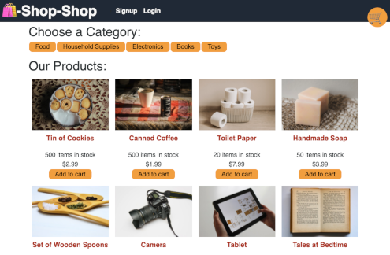
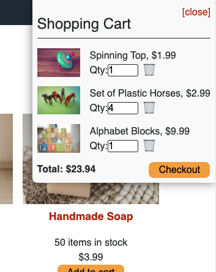
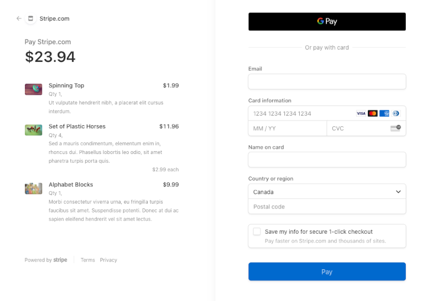

# Redux-Shop
 
## Description
An E-Commerce platform written with React.js framework using Global State provided through Redux and connected with Apollo/GraphQL to a MongoDB backend. 
Login, Shop for products, then Checkout in style thanks to the Stripe payment API.

Demo Site: https://qcent-e-shoppe.herokuapp.com/

## Table of Contents

* [Description](#description)
* [Table of Contents](#table-of-contents)
* [Usage](#usage)
* [Questions](#questions)

## Usage

Navigate to the [Site](https://qcent-e-shoppe.herokuapp.com/) and be greeted by this wonderful sight. 

Click on the products of your fancy and add them to your cart. Adjust the quantities if you wish from the Shopping cart sidebar, or Trash any items you are not interested in.

Once you've found all you came for, make sure you have logged in before checking out! Then just click the Checkout button from the shopping cart and you'll be taken to our third party affiliate Stripe.com, to complete the payment process.

## Questions

